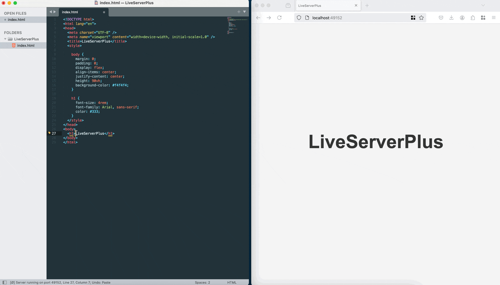

# Live Server Plus for Sublime Text

A lightweight development server with WebSocket‑based live reload.



---

## Installation

### Package Control (recommended)

1. Open the Command Palette: **`Cmd/Ctrl + Shift + P`**  
2. Select **Package Control: Install Package**  
3. Search for **“LiveServerPlus”** and install.

### Manual

1. Download or clone this repository.  
2. In Sublime Text, choose **Preferences ▸ Browse Packages…**  
3. Copy the folder into the `Packages` directory and name it **`LiveServerPlus`**.

---

## Usage

Open a file, folder or workspace (**File ▸ Open Folder**) first.

### Main menu

*Tools ▸ Live Server Plus*:

| Action | Description |
| ------ | ----------- |
| **Start Server** | Starts the server (multi‑folder picker). |
| **Stop Server** | Stops the server. |
| **Open in Browser** | Opens the active file through the server. |
| **Show Mobile QR Code** | Displays a QR linking devices on the LAN to the dev URL. |
| **Enable Live Reload** | Switch to Sublime-driven reload (auto-save option). |
| **Disable Live Reload** | Return to Watchdog-based external file watching. |
| **Change Port…** | Enter any port or **0** for “find a free one”. |
| **Settings…** | Opens the user settings file. |

### Command Palette

`Cmd/Ctrl + Shift + P` → type:

- **Live Server Plus: Start Server**  
- **Live Server Plus: Stop Server**  
- **Live Server Plus: Open in Browser**  
- **Live Server Plus: Show Mobile QR Code**  
- **Live Server Plus: Enable Live Reload**  
- **Live Server Plus: Disable Live Reload**  
- **Live Server Plus: Change Port…**  
- **Live Server Plus: Settings**

### Example workflow

1. Open your project folder.  
2. Run **Live Server Plus: Start Server**.  
3. Edit and save—your browser refreshes automatically.

---

## Features

- **Instant reload** on file changes; optional CSS-only injection. Enable Sublime-only mode when you want immediate reloads on save, or leave it disabled to monitor external tools via Watchdog.  
- **GitHub-style Markdown preview** with live scroll sync—defaults to editor→browser, switch to "sync" for two-way or `false` to disable.  
- **Mobile preview**: scan a QR code to open the site on any device.  
- **Port selection**: choose a port at startup or set `"port": 0` for a free one.  
- **Automatic watcher fallback**: native watchers for performance, seamless polling fallback when macOS hits the file-descriptor limit.  
- **Runs in Sublime’s bundled Python**—no external runtime required.

---

## Optional key bindings

```json
[
    { "keys": ["alt+shift+s"], "command": "live_server_start" },
    { "keys": ["alt+shift+o"], "command": "open_current_file_live_server" },
    { "keys": ["alt+shift+x"], "command": "live_server_stop" }
]
```

---

## Settings quick reference

```js
// LiveServerPlus.sublime-settings (user)
{
    "customBrowser": "",
    "openBrowser": true,
    "showInfoMessages": true,
    "verifyTags": true,
    "fullReload": false,
    "liveReload": false,
    "host": "127.0.0.1",
    // WARNING: use "0.0.0.0" only on trusted networks; it exposes the server to your LAN.
    "maxThreads": 64,
    "maxWatchedDirs": 50,
    "renderMarkdownPreview": true,
    "markdownScrollSync": "editor", // "editor", "sync", or false
    "ignoreFiles": ["**/node_modules/**", "**/.git/**", "**/__pycache__/**"],
    "logging": false,
    "port": 5500,
    "showOnStatusbar": true,
    "useLocalIp": false,
    "useWebExt": false,
    "wait": 100
}
```

Restart the server after changing settings.

> **Security note:** Binding the server to `0.0.0.0` exposes it to every device on your local network. Only use that host value on trusted networks.

---

## Requirements

- **Sublime Text 4** (Build ≥ 4152)  
- Browser with WebSocket support (Chrome, Firefox, Edge, Safari)

---

## Known limitations

- Watchdog mode watches up to 50 directories; adjust ignore globs or reduce scope for very large projects. When Live Reload is enabled, only saves inside Sublime trigger refreshes.

---

## Contributing

Contributions welcome! Issues and pull requests are welcome.

---

## Vendored dependencies

- **Watchdog** – filesystem events  
- **PyQRCode** and **pypng** – QR generation
- **markdown2** – Markdown → HTML conversion 

All vendored under `liveserverplus_lib/vendor/`.

---

## Support

Report bugs/issues on GitHub: <https://github.com/ifrederico/sublime-liveserverplus/issues>

---

## License

[MIT](./LICENSE)
