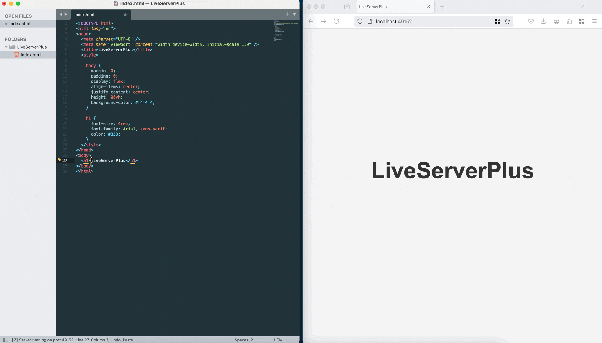
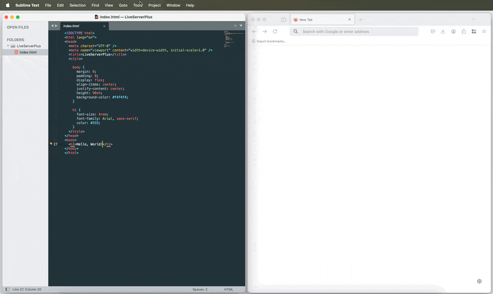

# Live Server Plus for Sublime Text

A lightweight development server with WebSocket-based live reload and directory listings—all from within Sublime Text.



## Usage

To use **Live Server Plus**, first open a folder or workspace (File » Open Folder) in Sublime Text. Then choose **either** of the following methods:

---

### 1. Main Menu

1. Go to **Tools » Live Server Plus**.  
2. Choose one of the following:
   - **Start Server**  
   - **Stop Server**  
   - **Open Current File**
  


### 2. Command Palette

1. Press `Cmd/Ctrl + Shift + P` to open the Command Palette.  
2. Type (and select) any of these commands:
   - **Live Server Plus: Start**  
     Starts the server on the configured port (shows a message if it’s already running).
   - **Live Server Plus: Stop**  
     Stops the running server.
   - **Live Server Plus: Open Current File**  
     Opens the active file in your browser using the dev server.
   - **Live Server Plus: Settings**  
     Opens the settings file for customizing port, host, live reload, etc.

## Features

- **Instant Refresh**  
  See your browser update the moment you save a file—no manual reloading needed.

- **No Extra Installs**  
  Runs purely on Python (already included with Sublime), so you can start right away.

- **Friendly Directory View & 404**  
  Browse your project’s files in a clean, auto-generated list, and get custom 404s with “did you mean?” suggestions.

- **Easy Setup for File Watching**  
  - **Sublime Events**: Rely on Sublime’s built-in events for instant reloads.  
  - **Built-in Watcher**: A fallback poll-based system to catch external file changes.

- **Tweak How You Like**  
  Pick your server host, port, or enable compression—and optionally open your default browser on start.

- **Status Bar Integration**  
  Stay in the flow: see if the server is running (and which port it’s on).

---

## Installation

### Via Package Control (Recommended)

1. Open the Command Palette: **`Cmd/Ctrl + Shift + P`**  
2. Select **“Package Control: Install Package”**  
3. Search for **“LiveServerPlus”** and install.

### Manual Installation

1. Download or clone this repository.
2. In Sublime Text, go to **`Preferences > Browse Packages…`**.
3. Move/copy the downloaded folder into the `Packages` directory.
4. Ensure the folder name is **`LiveServerPlus`**.

---

### Optional Key Bindings

You can add keyboard shortcuts by editing your Sublime key bindings. For example:
```json
    [
        {
            "keys": ["alt+shift+s"], 
            "command": "live_server_start"
        },
        {
            "keys": ["alt+shift+o"], 
            "command": "open_current_file_live_server"
        },
        {
            "keys": ["alt+shift+x"],
            "command": "live_server_stop"
        }
    ]
```

## Settings

Access the settings via **`Preferences > Package Settings > Live Server Plus > Settings`**. By default, you’ll see something like:
```json
    {
        // Choose "localhost" or "0.0.0.0", etc.
        "host": "localhost",

        // Set to 0 to find an available ephemeral port automatically
        "port": 5500,

        // How often (in seconds) the built-in watcher checks for changes
        "poll_interval": 1.0,

        // Folders to ignore when scanning for changes
        "ignore_dirs": ["node_modules", ".git", "__pycache__"],

        // Automatically open default browser when the server starts
        "open_browser_on_start": true,

        // A specific browser to open (e.g., "chrome", "firefox", "")
        "browser": "",

        // Allowed file types rendered inline (others served as downloads)
        "allowed_file_types": [".html", ".css", ".js", "..."],

        // Enable gzip compression for text-based files
        "enable_compression": true,

        // Show server status in Sublime's status bar
        "status_bar_enabled": true,

        // Enable/disable CORS headers
        "cors_enabled": false,

        // Sublime-based live reload settings
        "live_reload": {
            "enabled": true,
            "css_injection": true,
            "delay": 500,
            "ignore_exts": [".log", ".map"]
        }
    }
```
> **Note:** If you change `port` or `host` while the server is running, you must restart the server for those changes to take effect.

---

## Requirements

- **Sublime Text** 4
- A browser with WebSocket support (Chrome, Firefox, Safari, Edge, etc.)

---

## Known Limitations

- SSL/TLS (HTTPS) is not supported out-of-the-box. For secure local development, consider a reverse proxy or other HTTPS setup.
- Large projects with many files may see higher CPU usage in poll mode. You can disable poll-based watching (`live_reload.enabled = true`) for Sublime-based events or ignore large directories (`ignore_dirs`).

---

## License

MIT License (see the [LICENSE](./LICENSE) file for details).

---

## Contributing

We welcome pull requests for bug fixes, new features, or documentation improvements. Feel free to open an issue or PR on GitHub.

---

## Support / Issues

1. Check [Issues](https://github.com/ifrederico/sublime-liveserverplus/issues) for known problems or suggestions.
2. Open a new issue with:
   - **Operating System** (Windows, macOS, or Linux)
   - **Steps to reproduce**
   - **Expected vs. actual behavior**

Enjoy **LiveServerPlus**! If you find it useful, please consider giving the repo a star.
